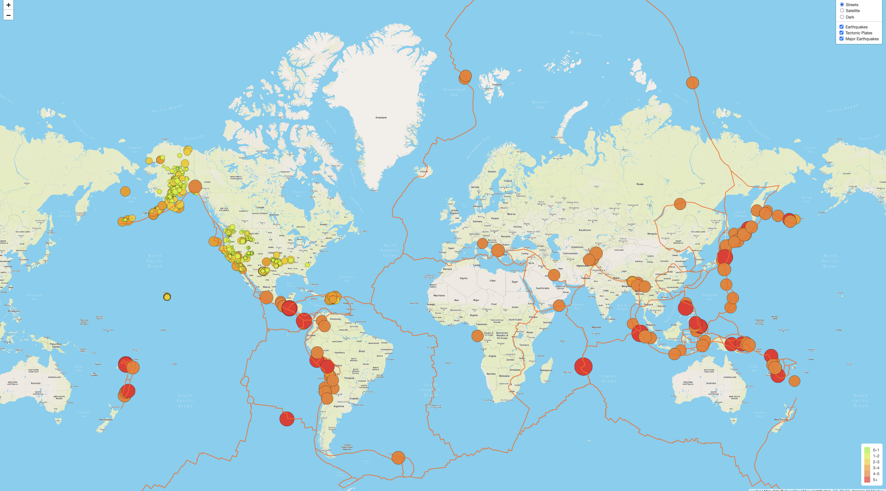
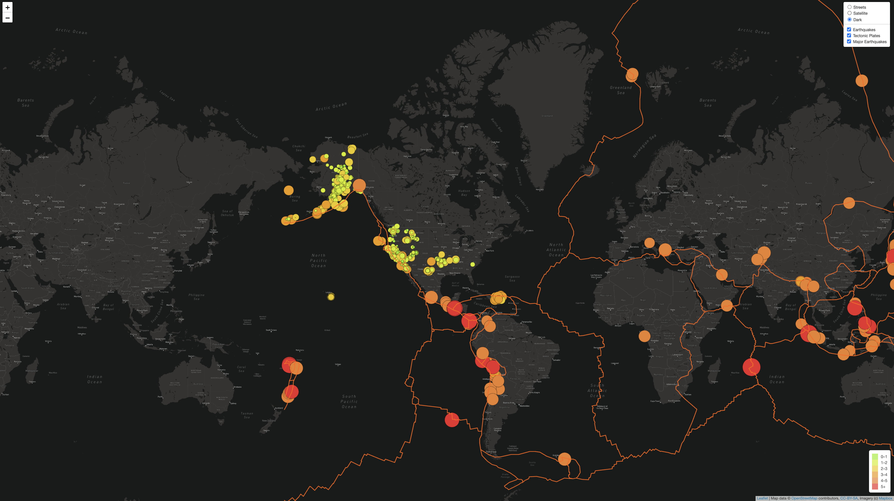

# Mapping-Earthquakes

## Purpose

The purpose for this assignment was to create a web page containing an earthquake map with three different maps and the earthquake overlay. The maps created enable the user to see the earthquake data in relation to the tectonic plates' location on the earth, and all the earthquakes with a magnitude greater than 4.5 on the map.

JavaScript, Leaflet.js, and GeoJSON data was used to build the maps. To retrieve geographical coordinates and magnitudes of the earthquakes from the GeoJSON data, we used the JavaScript and D3.js library. Leaflet.js library was used to plot the data on a Mapbox map through an API request, and create interactivity for the earthquake data.  The data was extracted from the following websites:

- https://github.com/fraxen/tectonicplates/blob/master/GeoJSON/PB2002_boundaries.json

- https://earthquake.usgs.gov/earthquakes/feed/v1.0/summary/4.5_week.geojson

- https://earthquake.usgs.gov/earthquakes/feed/v1.0/summary/all_week.geojson

The tectonic plate data was added to the layer group, the overlay object, and the map. When the webpage loads, the earthquake and tectonic plate data is displayed.
The major earthquake data was added as third layer group, and added to the map and styled. A third map layer tile (dark-v10) layer was created and added to the overlay object. 

## Results

All the earthquake data and tectonic plate data is beautifully displayed on all maps on the webpage.

Fig.1 Satellite Version

Fig.2 Street Version

Fig. 3 Dark Version

